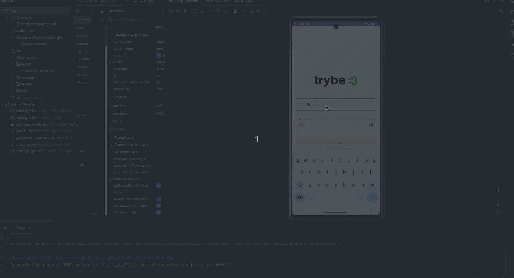

#   Login Application 

## 🌐 [](https://github.com/SamuelRocha91/kotlinLoginSocial/blob/main/README.md) [](https://github.com/SamuelRocha91/kotlinLoginSocial/blob/main/README_es.md) [](https://github.com/SamuelRocha91/kotlinLoginSocial/blob/main/README_en.md) [](https://github.com/SamuelRocha91/kotlinLoginSocial/blob/main/README_ru.md) [](https://github.com/SamuelRocha91/kotlinVirtualMenu/blob/main/README_ch.md) [](https://github.com/SamuelRocha91/kotlinLoginSocial/blob/main/README_ar.md)

Este projeto é uma aplicação Android que demonstra a implementação de um formulário de login com validação de entrada e feedback para o usuário. Desenvolvido utilizando Kotlin e a biblioteca Material Design, o aplicativo inclui funcionalidades básicas como validação de email e senha, e manipulação de eventos em campos de texto.


## Funcionalidades

- **Validação de Email e Senha**: Verifica se o email está no formato correto e se a senha tem mais de 4 caracteres.
- **Feedback Visual**: Mensagens de erro são exibidas em vermelho nos campos de texto quando a entrada é inválida.
- **Habilitação de Botão**: O botão de login é habilitado apenas quando ambos os campos de entrada são preenchidos corretamente.
- **Design Material**: Utiliza a biblioteca Material Design para um visual moderno e responsivo.

## Tecnologias Utilizadas

- **Kotlin**: Linguagem principal utilizada para o desenvolvimento do aplicativo.
- **Android SDK**: Ferramentas e APIs do Android para desenvolvimento.
- **Material Design**: Biblioteca para componentes visuais modernos e responsivos.

## Estrutura do Projeto

- **MainActivity.kt**: Atividade principal onde a lógica de validação e interação do usuário é implementada.
- **activity_main.xml**: Layout da interface do usuário, contendo campos de texto e botões.

## Como Executar

1. Clone este repositório em sua máquina local:
   ```sh
   git clone https://github.com/SamuelRocha91/kotlinLoginSocial.git
   ```

2. Abra o projeto no Android Studio.

3. Compile e execute o aplicativo em um emulador ou dispositivo Android.

## Outros projetos:

- 📜 [Virtual Menu](https://github.com/SamuelRocha91/kotlinVirtualMenu)
-  ☀️ [Weather App](https://github.com/SamuelRocha91/kotlinWeatherApp)
- 💱 [kotlin Exchange Rate](https://github.com/SamuelRocha91/kotlinExchangeRate)
